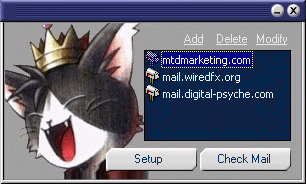



## Skinnable Multiple POP Email Checker

### Description

Multiple POP email checking utility. Skinnable. Encrypts passwords. Right click on tray icon for popup menu, left click on tray icon for popup summary of your email accounts.

I have been meaning to pull this together for awhile now, this is a mail control I wrote quite a while back. I wrote this program using my control to check mutliple accounts, then added Jeff Deaton's skin application. I ran out of time so the code is not very efficient or readable, so good luck working with it and have fun. =)
 
### More Info
 

             |
---                |---
**Submitted On**   |2001-12-11 13:08:56
**By**             |[Michael A\. Schmidt](https://github.com/Planet-Source-Code/PSCIndex/blob/master/ByAuthor/michael-a-schmidt.md)
**Level**          |Advanced
**User Rating**    |5.0 (30 globes from 6 users)
**Compatibility**  |VB 6\.0
**Category**       |[Complete Applications](https://github.com/Planet-Source-Code/PSCIndex/blob/master/ByCategory/complete-applications__1-27.md)
**World**          |[Visual Basic](https://github.com/Planet-Source-Code/PSCIndex/blob/master/ByWorld/visual-basic.md)
**Archive File**   |[Skinnable\_4121412112001\.zip](https://github.com/Planet-Source-Code/michael-a-schmidt-skinnable-multiple-pop-email-checker__1-29677/archive/master.zip)

